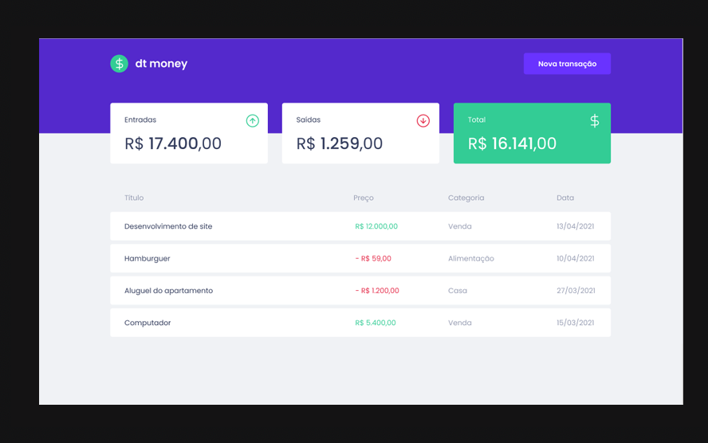

[](https://portfolio-nadi.vercel.app/)
[](https://twitter.com/nadiduno)
[](https://www.linkedin.com/in/nadiduno/)
<br />
<br />
LogicClasses: Uma aplicação para o ensino de lógica de programação para a comunidade migrante residente no Brasil.
<br />
<div align="center">
  
  <br />
</div>

<br/>
[ReactJS](https://reactjs.org/) | [Node.js](https://nodejs.org/en/download/) | [npm](https://www.npmjs.com/)


```bash
# Install the dependencies
$ npm i

# Run the developer
$ npm run dev
```
[Nadi Duno](https://www.linkedin.com/in/nadiduno/) © 2022